# Система поиска, анализа и выдачи статистических данных на основе нейронных сетей и методов RAG

RAG-система для работы со статистическими сборниками Национального статистического комитета Республики Беларусь (Белстат). Система автоматически парсит PDF-документы, обогащает их метаданными через LLM, строит векторное хранилище и отвечает на пользовательские запросы в виде структурированных таблиц и графиков.

## Архитектура решения

Система состоит из четырёх последовательных пайплайнов:

```mermaid
flowchart LR
    subgraph ingest [1. Загрузка документов]
        A[Сайт Белстата] -->|SiteParser| B[PDF-файлы]
    end

    subgraph build [2. Построение базы знаний]
        B -->|PDFChunker| C[Чанки]
        C -->|LLMEnricher| D[Обогащённые чанки]
        D -->|FAISSStore| E[FAISS индекс + data.json]
    end

    subgraph query [3. Обработка запроса]
        F[Запрос пользователя] -->|SpellChecker| G[Исправленный запрос]
        G -->|QueryContextEnricher| H[EnrichedQuery]
        H -->|HybridSearcher| I[Top-K чанков]
    end

    subgraph output [4. Формирование ответа]
        I -->|OutputPipeline| J[JSON-таблица]
        J --> K[DataFrame / Streamlit]
    end

    E -.->|загрузка индекса| query
```



### Модули

| Модуль | Назначение |
|--------|-----------|
| `src/core` | Доменные модели (`Chunk`, `EnrichedQuery`, `ScoredChunk`, `PipelineResult`) и конфигурации поиска |
| `src/ingestion` | Парсинг сайта Белстата (`SiteParser`), чанкинг PDF (`PDFChunker`), классификация чанков (`ChunkFilter`) |
| `src/enrichers` | HTTP-клиент Ollama, LLM-обогащение чанков метаданными, парсинг JSON-ответов |
| `src/retrieval` | Гибридный поиск: семантический (FAISS), лексический (BM25), metadata scoring |
| `src/vectorstore` | Генерация эмбеддингов (`SentenceVectorizer`), хранение в FAISS (`FAISSStore`) |
| `src/utils` | Логирование (JSONL), валидация JSON, спеллчекер, постобработка |
| `src/pipelines` | Оркестрация: `ParseDocumentsPipeline`, `KnowledgeBaseBuilder`, `QueryPipeline`, `OutputPipeline` |
| `usage/` | Точки входа: CLI, Streamlit-интерфейс, скрипты запуска |

### Гибридный поиск

Система комбинирует три канала поиска с нормализацией и взвешиванием:

- **Semantic Search** (55%) -- cosine similarity через FAISS по эмбеддингам `context`
- **Lexical Search** (25%) -- BM25 по полям `text`, `context`, `hints` (metrics + geo + years)
- **Metadata Scoring** (20%) -- точное/нечёткое совпадение `geo`, `metrics`, `years`, `time_granularity`, `oked`

## Стек технологий

| Категория | Технологии |
|-----------|-----------|
| Язык | Python 3.12 |
| LLM | Ollama (локальный inference) |
| Эмбеддинги | sentence-transformers (paraphrase-multilingual-MiniLM-L12-v2) |
| Векторный поиск | FAISS (IndexFlatIP + cosine similarity) |
| Лексический поиск | rank-bm25 (BM25Okapi) |
| NLP | Natasha (лемматизация русского языка) |
| Парсинг PDF | LlamaIndex (PDFReader) |
| Веб-интерфейс | Streamlit |
| Визуализация | Seaborn, Matplotlib |
| Данные | Pandas, openpyxl |

## Инструкция по запуску

### 1. Установка

```bash
# Клонирование репозитория
git clone <url> && cd rag-bseu

# Автоматическая настройка (создание venv + установка зависимостей)
python setup.py

# Или ручная установка
python -m venv .venv
.venv\Scripts\activate        # Windows
# source .venv/bin/activate   # Linux/macOS
pip install -r requirements.txt
```

### 2. Запуск Ollama

Система требует запущенный [Ollama](https://ollama.com/) сервер с моделью:

```bash
ollama pull llama3-chatqa:latest
ollama serve
```

### 3. Загрузка документов

Скачивание статистических сборников с сайта Белстата:

```bash
python usage/parse_documents.py
```

PDF-файлы сохраняются в `usage/archive_documents/`.

### 4. Построение базы знаний

Чанкинг PDF, обогащение через LLM и построение FAISS-индекса:

```bash
python usage/prepare_vector_store.py
```

Результат: `usage/vector_store/` (index.faiss, data.json, metadata.json).

### 5. Запуск запросов

**CLI-режим** (интерактивный терминал):

```bash
python usage/query.py
```

**Streamlit-интерфейс** (веб-приложение с таблицами и графиками):

```bash
streamlit run usage/query.py
```

**Единый CLI** (все команды):

```bash
python usage/cli.py --parse-documents
python usage/cli.py --prepare-vector-store
python usage/cli.py --query
```

## Структура проекта

```
rag-bseu/
├── src/
│   ├── core/               # Модели данных и конфигурации
│   ├── enrichers/           # Взаимодействие с LLM (Ollama)
│   ├── ingestion/           # Парсинг PDF и классификация чанков
│   ├── pipelines/           # Оркестрация пайплайнов
│   ├── retrieval/           # Гибридный поиск
│   ├── utils/               # Утилиты (логи, валидация, спеллчекер)
│   └── vectorstore/         # FAISS и эмбеддинги
├── usage/
│   ├── documents/           # PDF-документы для обработки
│   ├── vector_store/        # FAISS-индекс и данные
│   ├── outputs/             # JSON-ответы LLM
│   ├── logs/                # Логи ошибок (JSONL)
│   ├── cli.py               # Единый CLI
│   ├── query.py             # Интерактивный запрос (CLI + Streamlit)
│   ├── parse_documents.py   # Скрипт загрузки документов
│   └── prepare_vector_store.py  # Скрипт построения базы знаний
├── requirements.txt
├── setup.py
└── LICENSE
```

## Автор

**Александр Лебедев**

## Лицензия

Apache License 2.0 -- см. [LICENSE](LICENSE).
